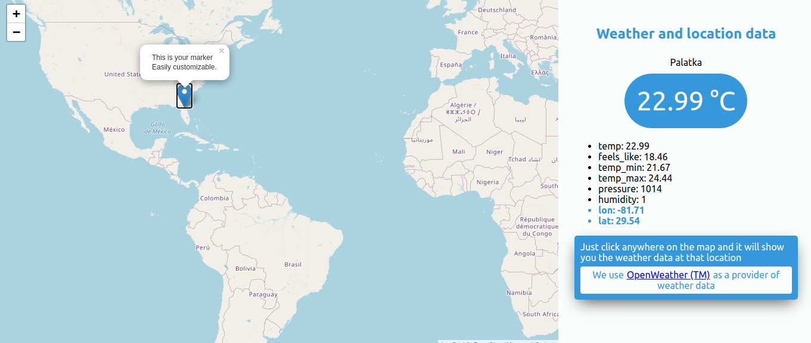

# Construye mapas dinámicos desde 0 consumiendo data desde una REST API utilizando ReactJS + Hooks

En este tutorial vas a aprender a crear mapas dinámicos totalmente gratis, con marcadores y obtener las coordenadas del mapa, construyendo una app del clima utilizando reactJS.

  
# Introducción

-   Estaremos explorando reactJS así que es necesario que cuentes con conocimientos básicos con esta tecnología y con JavaScript.
    
-   Crearemos una app del clima que te dice la temperatura del lugar donde hiciste click en cualquier lugar del mapa manejando peticiones HTTP. También aprenderás a colocar marcadores en el mapa.
    
-   Para seguir el tutorial utilizaremos Create React App y la API de  [https://openweathermap.org/api](https://openweathermap.org/api)

- Este tutorial se creó con las siguientes versiones: React versión 16.14.0, react-dom 16.14.0, react-leaflet: 2.7.0, axios: 0.20.0, nodeJS v12.18.3, NPM 6.14.8



# **Empezando - Preparación**

Antes de crear tu proyecto con [**Create React App**](https://create-react-app.dev/) asegurate de tener instalado ***nodeJS*** en tu computador [https://nodejs.org/es/download/](https://nodejs.org/es/download/)


-   Como primer paso abre una línea de comando o terminal y tipea 
`$ npx create-react-app my-first-map`
	>  npx viene con npm 5.2+ y superior
	

    
-   Vas a ver que se creo una carpeta con el nombre de my-first-map muévete a ella desde la terminal con 
	 `$ cd my-first-map`
    
-   Enhorabuena ya tienes tu app de react lista para comenzar a trabajar puedes tipear `$ npm start` y abrir esta URL [http://localhost:3000/](http://localhost:3000/)
- 
# Nuestro primer mapa

Para poder crear nuestro primer mapa con reactJS estaremos utilizando **Leaflet** es una librería *open-source* para poder crear mapas gratis con JS, estaremos utilizando **react-leaflet** (react-leaflet es una librería basada en Leaflet pero adaptada en componentes de react) [https://react-leaflet.js.org/](https://react-leaflet.js.org/)

## Pasos:

 -   Instalar react-leaflet y leaflet en nuestro proyecto 
	`$ npm install react-leaflet leaflet`
    
 -   Crear un archivo llamado **MapComponent.js** dentro de */src* y vamos a crear un componente de tipo función llamado **MapComponent** dentro de este mismo archivo
    
 -   Importamos los componentes para poner nuestro mapa 
`import { Map, Marker, Popup, TileLayer } from 'react-leaflet'`

 - Excelente ya estamos a un solo paso de crear nuestro primer mapa solo nos falta una cosa y es colocar en el *index.html* los estilos css base que necesita **Leaflet** para funcionar y mostrar los mapas correctamente dentro de las etiquetas `<head> nuestro link </head>`

	> Ruta donde tienes que agregar la una etiqueta HTML **public/index.html*

    ```
       <link
        	    rel="stylesheet"
        	    href="https://unpkg.com/leaflet@1.6.0/dist/leaflet.css"
        	    integrity="sha512-xwE/Az9zrjBIphAcBb3F6JVqxf46+CDLwfLMHloNu6KEQCAWi6HcDUbeOfBIptF7tcCzusKFjFw2yuvEpDL9wQ=="
        	    crossOrigin=""
        />
    ```

 - Ahora lo que nos falta es colocar en el render los componentes que van a generar nuestro mapa para eso nuestro componente se va a ver así:
```
import React from 'react'
import { Map, Marker, Popup, TileLayer } from 'react-leaflet'
export const MapComponent = ({ positionDefault = [4.660779178475431, -74.08494168529754] }) => {
    return (
        <Map center={positionDefault} zoom={4} style={{ height: '500px', width: '100%' }}>
            <TileLayer
            url='https://{s}.tile.openstreetmap.org/{z}/{x}/{y}.png'
            attribution='&copy; <a href=&quot;http://osm.org/copyright&quot;>OpenStreetMap</a> contributors'
            />
            <Marker position={[4.660779178475431, -74.08494168529754]}>
                <Popup>This is your marker<br />Easily customizable.</Popup>
            </Marker>
        </Map>
    )
}
```
- Para ver tu mapa tienes que ir a src/App,js | importar el componente y renderizarlo en la app 
```
import { MapComponent } from './MapComponent'
const App = () => {
  return (
    <>
      <MapComponent />  
    </>
  )
}
```
Felicitaciones acabas de crear tu primer mapa con un marcador utilizando reactJS y react-leaflet, si te pudiste dar cuenta tenemos a Map que recibe por props unos valores para poder funcionar y son el center, zoom, y los estilos style, son gracias a estas props que le indicamos al mapa donde queremos centrar nuestro mapa el zoom que tenga y los estilos para poder darle dimensiones al mapa. Luego dentro de Map tenemos a TileLayer este componente recibe dos props la URL y la attribution este lo que hace es poder mostrar la cartografía del mapa, (Esa es una de las mejores ventajas al crear mapas con Leaflet, Leaflet nos propone herramientas para poder crear nuestros mapas pero nosotros podemos usar como material cartográfico en que queramos en este caso estamos usando openstreetmap pero podemos usar mapbox o el que más te guste)
Ya una vez con tu mapa puedes poner dentro de él marcadores como nosotros colocamos uno y este recibe las coordenadas del marcador y dentro con un Popup que nos permite mostrar un Popup cuando se hace click encima de este marcador.

Aqui te dejo algunos ejemplos de los mapas que puedes hacer https://leafletjs.com/examples.html

# Manejar onClick de nuestro mapa y obtener coordenadas de ese evento

Ya que aprendiste a crear un mapa básico, vamos a subir un poco la complejidad de este mapa, que te parece si creamos un mapa que al hacer click en cualquier lugar del mapa este me retorna las coordenadas para yo poder crear un marcador.

- Lo primero que tenemos que hacer es empezar a manejar los eventos onClick del mapa, onClick recibe una funcion con el evento en este caso nosotros solo estamos mostrando en consola ‘click’ cada vez que se hace un click encima del mapa.
```
<Map center={positionDefault} zoom={4} style={{ height: '500px', width: '100%' }} onClick={(e) => console.log('click')}>
      <TileLayer
        url='https://{s}.tile.openstreetmap.org/{z}/{x}/{y}.png'
        attribution='&copy; <a href=&quot;http://osm.org/copyright&quot;>OpenStreetMap</a> contributors'
      />
      <Marker position={[4.660779178475431, -74.08494168529754]}>
        <Popup>This is your marker<br />Easily customizable.</Popup>
      </Marker>
    </Map>

```
- Ya manejando este flujo podemos pasarle al evento onClick una funcion handler que maneje cada vez que hacemos click en el mapa y para ver las coordenadas de donde se hizo click solo tenemos que acceder al e.latlng del evento este nos retorna un objeto con la latitud y longitud de donde se hizo click.
```
import React from 'react'
import { Map, Marker, Popup, TileLayer } from 'react-leaflet'


export const MapComponent = ({ positionDefault = [4.660779178475431, -74.08494168529754] }) => {
  const handleClick = (e) => {
    console.log(e.latlng) // muestra en consola las coordenadas
  }


  return (
    <Map center={positionDefault} zoom={4} style={{ height: '500px', width: '100%' }} onClick={handleClick}>
      <TileLayer
        url='https://{s}.tile.openstreetmap.org/{z}/{x}/{y}.png'
        attribution='&copy; <a href=&quot;http://osm.org/copyright&quot;>OpenStreetMap</a> contributors'
      />
      <Marker position={[4.660779178475431, -74.08494168529754]}>
        <Popup>This is your marker<br />Easily customizable.</Popup>
      </Marker>
    </Map>
  )
}
```
- Sabiendo esto ya podemos hacer cosas grandiosas como cada vez que se haga click colocar nuevos marcadores donde se hizo click, para hacer eso tenemos que utilizar el hook useState este nos permite manejar state como lo hacíamos en componentes de tipo clase pero ahora disponible en componentes funcionales gracias a este hook solo tenemos que importarlo y usarlo asi:
```
import React, { useState } from 'react'
import { Map, Marker, Popup, TileLayer } from 'react-leaflet'


export const MapComponent = ({ positionDefault = [4.660779178475431, -74.08494168529754] }) => {
  const [markers, setMarkers] = useState([[4.660779178475431, -74.08494168529754]])
  const handleClick = (e) => {
    console.log(e.latlng)
    setMarkers([...markers, [e.latlng.lat, e.latlng.lng]])
  }


  return (
    <Map center={positionDefault} zoom={4} style={{ height: '500px', width: '100%' }} onClick={handleClick}>
      <TileLayer
        url='https://{s}.tile.openstreetmap.org/{z}/{x}/{y}.png'
        attribution='&copy; <a href=&quot;http://osm.org/copyright&quot;>OpenStreetMap</a> contributors'
      />
      {
        markers.map((markerPosition, i) => {
          return (
            <Marker position={markerPosition} key={i}>
              <Popup>
                lat: {markerPosition[0]}
                <br />
                lng: {markerPosition[1]}
              </Popup>
            </Marker>
          )
        })
      }
    </Map>
  )
}
```
Este código lo que hace es cada vez que hacemos click en cualquier lugar del mapa se genera un nuevo marcador en ese lugar con un popup que cuando lo abres te muestra las coordenadas de ese marcador, fijate en el handleClick cada vez que hacemos click este seteamos el estado con **setMarkers([...markers, [e.latlng.lat, e.latlng.lng]])** | hacemos un Spread sobre markers y luego añadimos otro array con la nueva lat y lng del nuevo marcador. Al modificar el estado se genera un nuevo render y este nuevo marcador se muestra en el mapa con su Popup

# PETICIONES HTTP PARA OBTENER LOS DATOS DEL CLIMA DE UN LUGAR (APP DEL CLIMA)

Perfecto hasta ahora ya sabes cómo manejar los eventos click del mapa y sabes como colocar marcadores en el mapa con su Popup, excelente pero imaginate crear un mapa y cada vez que se haga click en una posición manejar esas coordenadas para por ejemplo obtener el pronóstico del clima mediante peticiones HTTP de ese lugar genial no? Comencemos:

- Como primer paso tenemos que instalar axios https://www.npmjs.com/package/axios como dependencia de nuestro proyecto para poder realizar peticiones HTTP (también puedes utilizar fetch API del navegador) 
`
$ npm i axios
`

- Una vez instalado axios ya estamos listos para poder realizar peticiones a un API en este caso vamos a consultar los datos desde https://openweathermap.org/api es necesario registrarse para obtener la **API_KEY** necesaria para que nos responda con los datos del clima

- Lo primero que tenemos que hacer es detectar en el componente padre de **MapComponent** se entere cada vez que hay un evento click y justo cuando se detecte ese evento en App.js (el padre del mapa) realizar la peticion HTTP mandandole las coordenadas a la API para que esta nos retorne los datos del clima en esas coordenadas
```
// App.js
import React, { useState, useCallback } from 'react'
import axios from 'axios'
import { MapComponent } from './MapComponent'

const App = () => {
  const [dataApi, setDataApi] = useState({ isLoadingApi: false, errorApi: false, data: {} })

  const fetchData = useCallback(async (coord) => {
    setDataApi({ ...dataApi, isLoadingApi: true })
    try {
      const { data } = await axios.get(`https://api.openweathermap.org/data/2.5/weather?lat=${coord.lat}&lon=${coord.lng}&units=metric&appid=TU_API_KEY`)
      setDataApi({ ...dataApi, isLoadingApi: false, errorApi: false, data })
      console.log(data)
    } catch (error) {
      setDataApi({ ...dataApi, isLoadingApi: false, errorApi: error?.message })
    }
  }, [dataApi])

  const handleOnClickMap = (coords) => {
    fetchData(coords)
  }
  
  return (
    <>
      <MapComponent 
        onClickMap={handleOnClickMap}
      />
     <div>
      <h2>Weather and location data</h2>
      {dataApi.errorApi && <div><span>⚠ {dataApi.errorApi} ⚠</span></div>}
      <div>
        <div>
          {
            dataApi.isLoadingApi
              ? <span>Cargando...</span>
              : (
                <span>
                  <span>{dataApi.data?.name}</span>
                  <br />
                  <span>
                    {dataApi.data?.main?.temp || 0} °C
                  </span>
                </span>
              )
          }
        </div>
        {
          (Object.keys(dataApi.data).length > 0 && !dataApi.isLoadingApi) && (
            <div>
              <ul>
                {
                  Object.keys(dataApi.data?.main).map((elem, i) => {
                    return (<li key={i}>{elem}: {dataApi.data?.main[elem]}</li>)
                  })
                }
                {
                  Object.keys(dataApi.data?.coord).length > 0 && Object.keys(dataApi.data?.coord).map((elem, i) => {
                    return (<li key={i}>{elem}: {dataApi.data?.coord[elem]}</li>)
                  })
                }
              </ul>
            </div>
          )
        }
      </div>
    </div>
    </>
  )
}

export default App
```
- Como podemos ver el componente App.js le pasa por props una función a mapComponent y esta se llama cada vez que dan click en cualquier lugar del mapa `onClickMap={handleOnClickMap}`, esta recibe por parametros las coordenadas ya luego realizamos la HTTP request para obtener los datos del clima en esas coordenadas y ya luego seteamos el estado para luego mostrarlos en la UI, En **MapComponent** lo unico que hacemos es recibir por props la función onClickMap y en el handleClick llamar a esa funcion que llega por props pasandole las coordenadas asi:
```
export const MapComponent = ({ positionDefault = [4.660779178475431, -74.08494168529754], onClickMap }) => {
  const [markers, setMarkers] = useState([[4.660779178475431, -74.08494168529754]])
  const handleClick = (e) => {
    setMarkers([...markers, [e.latlng.lat, e.latlng.lng]])
    onClickMap(e.latlng) // evento que le notifica al padre pasandole las coordenadas
  }

  return (
    <Map center={positionDefault} zoom={4} style={{ height: '500px', width: '100%' }} onClick={handleClick}>
…
```

# ¿Que sigue?

Felicitaciones si has llegado hasta aqui aprendiste los conceptos básicos para hacer mapas con reactJS y Leaflet solo ten en cuenta que esto es solo una pequeña parte de lo que puedes hacer te invito a seguir investigando y aprendiendo sobre el tema para construir mapas mas complejos y divertidos.

## No te limites... 
Utilizando todas las características que nos ofrece reactJS y react-leaflet (Leaflet) podemos hacer mapas de cualquier tipo. De todas maneras aqui te dejo los enlaces oficiales de las librerías utilizadas en este tutorial, y si descargas este repositorio y instalas las dependencias vas a poder encontrar la última parte del tutorial (app del clima) (mejor organizada/estructurada con estilos css, etc) pero utilizando los mismos conceptos aprendidos en este tutorial para poder construir mapas con reactJS desde 0 totalmente gratis.

Para descargar el proyecto terminado puedes clonar este repositorio https://github.com/willydavid1/maps-with-react, instalar las dependencias ```$ npm i``` y crear un archivo **.env** en la raíz del repositorio abrirlo y pegar REACT_APP_APIKey=API_KEY_DE_OPENWEATHERMAP tienes que registrarte en openweathermap.org para obtener la API_KEY, si quieres aprender más sobre variables de entorno link [https://es.wikipedia.org/wiki/Variable_de_entorno](https://es.wikipedia.org/wiki/Variable_de_entorno)

# LINKS
- https://react-leaflet.js.org/
- https://leafletjs.com/
- https://leafletjs.com/examples.html
- https://es.reactjs.org/
- https://github.com/axios/axios
- https://es.reactjs.org/docs/hooks-reference.html

# License
**MIT**